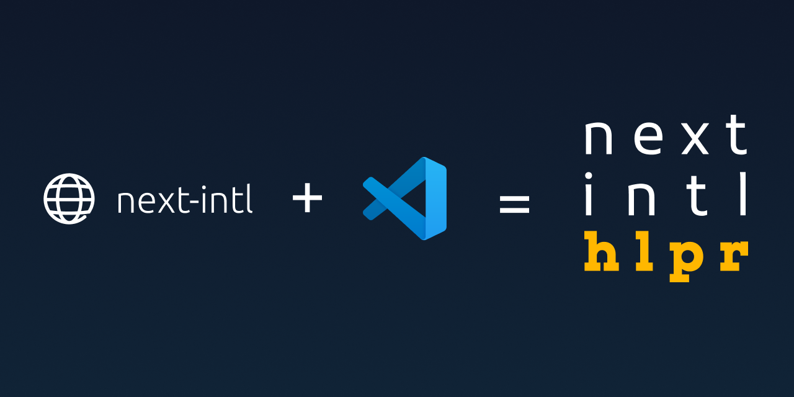

# next-intl-hlpr



A VS Code extension to highlight missing translations in next-intl JSON files and show missing languages on hover.

Download at [VSCode Marketplace](https://marketplace.visualstudio.com/items?itemName=felipestanzani.next-intl-hlpr)

## Features

- Highlights JSON keys missing in other language files, including nested properties (e.g., `nested.message`).
- Shows missing languages on hover.
- Supports two translation file structures:
  - Single file per language (e.g., `messages/en.json`, `messages/de.json`).
  - Multiple JSON files per language in subfolders (e.g., `messages/en/common.json`, `messages/en/errors.json`).
- In folder mode, compares only equivalent files (e.g., `en/view.json` with `es/view.json`, not `es/errors.json`).
- Configurable translations folder path and mode via settings.

## Requirements

- Translation files must be organized in one of two ways:
  - **Single-File Mode**: JSON files directly in the translations folder, named by language (e.g., `messages/en.json`).
  - **Multi-File Mode**: Language-specific subfolders containing one or more JSON files (e.g., `messages/en/common.json`).
- The extension detects the structure automatically (`auto` mode prioritizes folder mode) or uses the configured mode.

## Extension Settings

This extension contributes the following settings:

- `nextIntlHlpr.translationsFolder`: Path to the folder containing translation files (relative to workspace root). Defaults to `messages`.
- `nextIntlHlpr.translationsMode`: Preferred mode for translation files. Options:
  - `auto`: Detects based on folder contents, prioritizing folder mode (subfolders) over single-file mode (default).
  - `single-file`: Expects one JSON file per language (e.g., `en.json`).
  - `folder`: Expects language subfolders with JSON files (e.g., `en/common.json`).

## Usage

1. Place translation JSON files in a folder (e.g., `messages/` or as configured) using one of these structures:
   ```
   // Single-File Mode
   messages/
   ├── en.json
   ├── de.json
   ```
   ```
   // Multi-File Mode
   messages/
   ├── en/
   │   ├── common.json
   │   ├── errors.json
   ├── de/
   │   ├── common.json
   ```
2. Configure the mode in VS Code settings if needed (e.g., for migration):
   - Go to **Preferences > Settings** and search for `nextIntlHlpr.translationsMode`.
   - Set to `single-file` or `folder` to enforce a mode.
3. Open a JSON file to see warnings for missing translations.
4. Hover over a warned key to see missing languages.

## Migration Example

If migrating from single-file to folder mode:

1. Start with single-file structure:
   ```
   messages/
   ├── en.json
   ├── de.json
   ```
2. Set `nextIntlHlpr.translationsMode` to `single-file` in settings.
3. Move files to folders:
   ```
   messages/
   ├── en/
   │   ├── common.json
   ├── de/
   │   ├── common.json
   ```
4. Change `nextIntlHlpr.translationsMode` to `folder` or leave as `auto` (it will prioritize folder mode).
5. The extension will process the new structure without code changes.

## Example

### Single-File Mode

**messages/en.json**:

```json
{
  "greeting": "Hello",
  "nested": { "message": "Nested message" }
}
```

**messages/de.json**:

```json
{
  "greeting": "Hallo"
}
```

Opening `messages/en.json` will show a warning on `nested.message` (missing in `de`).

### Multi-File Mode

**messages/en/common.json**:

```json
{
  "greeting": "Hello",
  "nested": { "message": "Nested message" }
}
```

**messages/en/errors.json**:

```json
{
  "error404": "Not Found"
}
```

**messages/de/common.json**:

```json
{
  "greeting": "Hallo"
}
```

Opening `messages/en/common.json` will show a warning on `nested.message` (missing in `de/common.json`). The extension will not compare with `de/errors.json`.

## Release Notes

### 0.0.1

- Initial release with missing translation detection and hover info.

---
