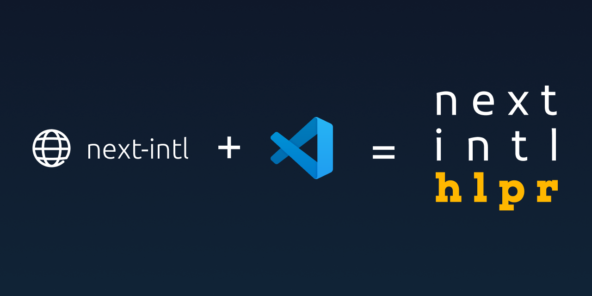

# next-intl-hlpr



A VS Code extension to highlight missing translations in `next-intl` JSON files and show missing languages on hover.

Download at [VSCode Marketplace](https://marketplace.visualstudio.com/items?itemName=felipestanzani.next-intl-hlpr)

[Oficial website](https://next-intl-hlpr.felipestanzani.com)

## Features

- Highlights JSON keys missing in other language files, including nested properties (e.g., `nested.message`).
- Shows missing languages on hover for warned keys.
- Groups missing translations for better readability:
  - Missing translations are grouped by key, showing all missing locales in a single warning
  - Missing nested translations are grouped by parent key, showing all missing keys per locale
  - Clear and concise warning messages format
- Supports two translation file structures:
  - **Single file per language**: One JSON file per language (e.g., `messages/en.json`, `messages/de.json`).
  - **Namespace per language**: Language-specific subfolders with multiple JSON files (e.g., `messages/en/common.json`, `messages/en/errors.json`).
- In folder mode, compares only equivalent files (e.g., `en/common.json` with `de/common.json`, not `de/errors.json`).
- Dynamically updates diagnostics when translation files (`*.json`) are created, renamed, or deleted within the translations folder.
- Handles complex JSON structures, including nested objects and escaped keys.
- Treats empty strings (`""`) as missing translations for stricter validation.
- Optimized performance with caching for large translation files and frequent hover interactions.

## Requirements

- Translation files must be organized in one of two ways:
  - **Single file per language**: JSON files directly in the translations folder, named by language (e.g., `messages/en.json`).
  - **Namespace per language**: Language-specific subfolders containing one or more JSON files (e.g., `messages/en/common.json`).
- The extension detects the structure automatically using next-intl configuration files.
- A workspace folder must be open in VS Code.
- JSON files must be valid (malformed JSON will trigger an error notification).

## Extension Settings

This extension contributes the following settings:

- Language codes (e.g., `en`, `de`) are derived from file names or folder names. Ensure names match across languages for accurate comparisons. Future versions may support configurable language code validation.

## Installation

1. Install the extension from the VS Code Marketplace or by sideloading the `.vsix` file.
2. Open a JSON translation file to start seeing diagnostics and hover information.

## Usage

1. Place translation JSON files in a folder (e.g., `messages/` or as configured) using one of these structures:
   ```
   // Single-File Mode
   messages/
   ├── en.json
   ├── de.json
   ```
   ```
   // Folder Mode
   messages/
   ├── en/
   │ ├── common.json
   │ ├── errors.json
   ├── de/
   │ ├── common.json
   ```
2. Open a JSON file to see warnings for missing translations.
3. Hover over a warned key to see missing languages.
4. Rename, add, or delete translation files, and diagnostics will update automatically.

## Example

### Single-File Mode

**messages/en.json**:

```json
{
  "greeting": "Hello",
  "nested": {"message": "Nested message"}
}
```

**messages/de.json**:

```json
{
  "greeting": "Hallo"
}
```

Opening `messages/en.json` will show a warning on `nested.message` (missing in `de`). Hovering over `nested.message` shows:

```
**Missing Translations**
Key: `nested.message`
Missing languages: `de`
```

### Folder Mode

**messages/en/common.json**:

```json
{
  "greeting": "Hello",
  "nested": {"message": "Nested message"}
}
```

**messages/en/errors.json**:

```json
{
  "error404": "Not Found"
}
```

**messages/de/common.json**:

```json
{
  "greeting": "Hallo"
}
```

Opening `messages/en/common.json` will show a warning on `nested.message` (missing in `de/common.json`). Hovering over `nested.message` shows:

```
**Missing Translations**
Key: `nested.message`
Missing languages: `de`
```

Renaming `common.json` to `newCommon.json` will automatically update diagnostics to compare `en/newCommon.json` with `de/newCommon.json`.

## Troubleshooting

- **Diagnostics don't update after renaming files**:
  - Ensure a workspace folder is open.
  - Restart VS Code to reinitialize the file system watcher if changes are not detected.
- **Errors about malformed JSON**:
  - Fix invalid JSON in the reported file (notifications will show the file path).

## Known Limitations

- Language codes (e.g., `en`, `de`) are not validated; any folder or file name is treated as a language.
- Multi-root workspaces use the first workspace folder containing the translations folder.

## Release Notes

See [RELEASE_NOTES.md](RELEASE_NOTES.md) for detailed version history and changes.

## Known Issues

- Non-standard JSON files (e.g., with comments) may cause parsing errors. Clean your JSON files or report issues for support.
- Complex JSON structures may lead to inaccurate key position detection. Share sample files to improve the parser.

## Contributing

Contributions are welcome! Please open an issue or pull request on the [GitHub repository](https://github.com/felipestanzani/next-intl-hlpr).

## License

MIT License. See [LICENSE](LICENSE) for details.
